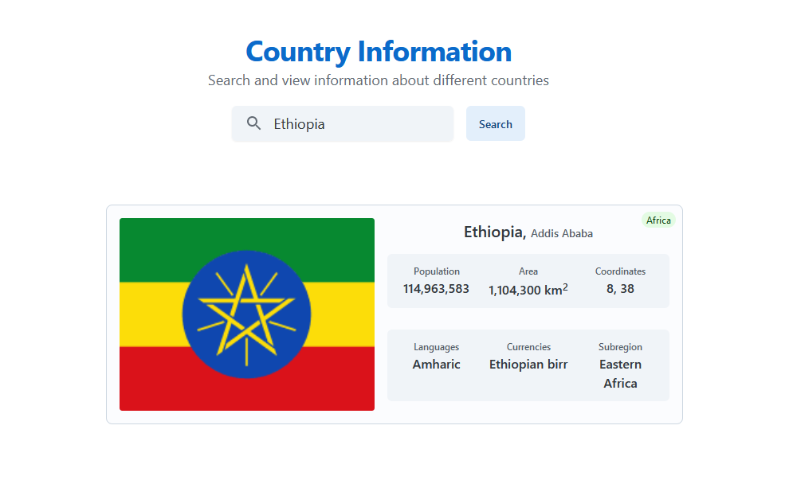

# Country Information

## Purpose

This web application allows users to search for and view information about different countries using the REST Countries API. Users can search for a country, and the app displays details such as the country's name, flag, capital, region, subregion, population, coordinates, currencies and languages.

## Features

- Search for countries by name.
- Display country information in a card format.
- Error message for invalid or empty inputs.

## Design

The application is built using React with TypeScript, and it uses the Axios library to fetch data from the REST Countries API.

## Usage

1. Clone this repository.
2. Install dependencies using `npm install`.
3. Run the app using `npm start`.
4. Open [http://localhost:3000](http://localhost:3000) to view it in the browser.
5. Enter a country name in the search bar and click the search button to view the country's information.

## Screenshot

## Credits

- [REST Countries API](https://restcountries.eu/)
